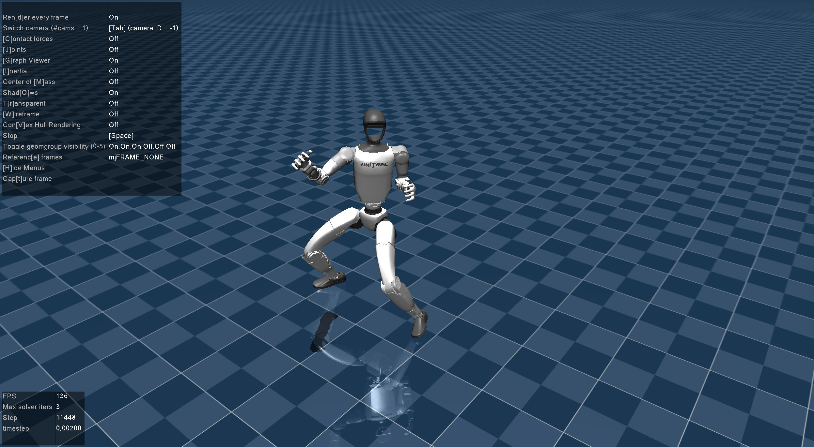
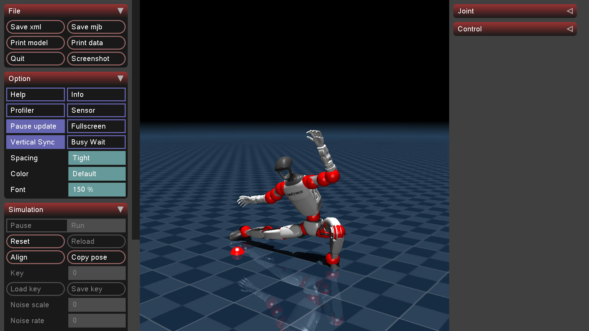
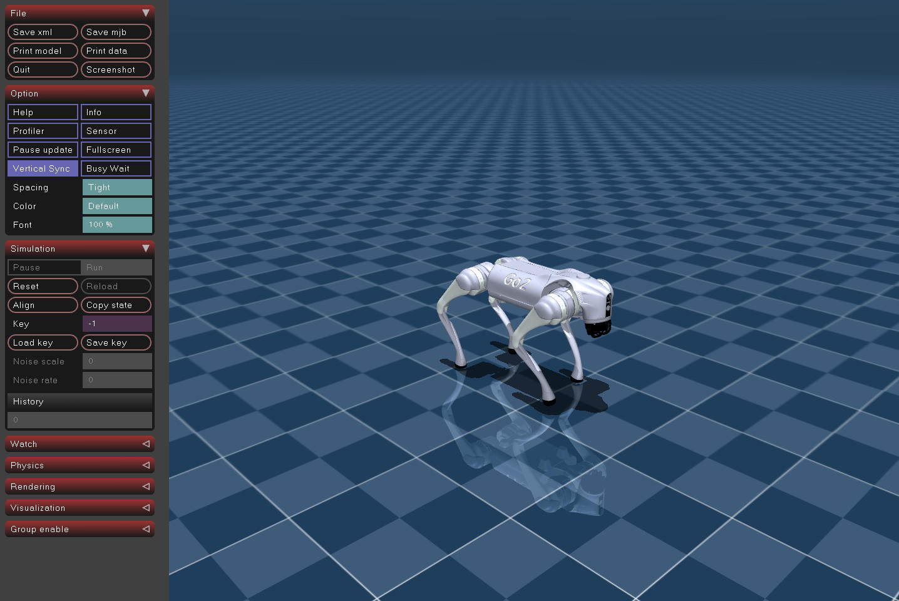

# MuJoCo Experience

Google DeepMind MuJoCo 物理引擎学习与实践项目。MuJoCo (Multi-Joint dynamics with Contact) 是一个高性能的物理仿真引擎，广泛用于机器人学、生物力学和机器学习研究。

_Learning & practice repo for Google DeepMind's MuJoCo physics engine — robotics, biomechanics, ML research._

---

## ✨ RoboCasa × GR00T — OpenCabinet 操作 (Manipulation)

_NVIDIA GR00T VLA policy opening kitchen cabinet in RoboCasa sim_

把 [NVIDIA Isaac-GR00T](https://github.com/robocasa-benchmark/Isaac-GR00T) 的预训练 **GR00T N1.5 atomic-seen post-trained** 策略接入 [RoboCasa](https://robocasa.ai) 厨房仿真，让 **PandaOmron**（Franka Panda + Omron LD-60 移动底盘）端到端完成 atomic 操作任务。下图为 **OpenCabinet** 任务实跑录屏：

_Pretrained GR00T N1.5 policy (atomic-seen post-trained checkpoint) drives PandaOmron through an OpenCabinet task end-to-end in the RoboCasa kitchen sim. Video shows live rollout._

<div align="center">

https://github.com/user-attachments/assets/b6f40084-5e8d-4c2d-a248-f4d50ba8c846

</div>

### N1.7 自训版 / N1.7 fine-tuned (single RTX 4090)

_GR00T-N1.7-3B single-task fine-tune; MimicGen two-stage lifts SR to 53.3% (fair 30/30)_

从 N1.7-3B base 在 RoboCasa OpenCabinet 上微调（单卡 4090）。两条路线：

1. **human-only**:500 条人类遥操作数据，seed-locked 精扫峰值 **50%**（step 11k）——保留在 HF 分支 [`human500-ckpt-11000`](https://huggingface.co/wsagi/GR00T-N1.7-RoboCasa-OpenCabinet)。
2. **MimicGen 两阶段 ⭐**:阶段一用 8644 条 MimicGen 生成 episode + 500 human 原生混合（GR00T data factory 按权重混，不做物理合并）预训到 ~34k；阶段二回纯 human 微调对齐评测分布，峰值 **step 14000**。公平 30/30（同 seed 同款橱柜、DNF 重试凑满、零剔除偏置）**53.3%**——现为 HF `main` 模型 [HF model card](https://huggingface.co/wsagi/GR00T-N1.7-RoboCasa-OpenCabinet)。

公平榜单(1200 步 / `n_action_steps=16` / seed_base=0)：**N1.5-multitask 70% > N1.7-MG2stage(14k) 53.3% > pi0.5 23.3%**。MimicGen 较 human-only 提升真实约 10 点，但**未超**大得多的多任务 N1.5。详见 [`robocasa-training`](https://github.com/vitorcen/robocasa-training) 与 [`benchmark/leaderboard.md`](https://github.com/vitorcen/robocasa-training/blob/main/benchmark/leaderboard.md)。

_Fine-tuned from N1.7-3B on OpenCabinet (single 4090). **(1) human-only**: 500 demos, seed-locked sweep peaks at 50% (step 11k), kept on HF branch [`human500-ckpt-11000`](https://huggingface.co/wsagi/GR00T-N1.7-RoboCasa-OpenCabinet). **(2) MimicGen two-stage ⭐**: stage-1 native-mix pretrain on 8644 MimicGen episodes + 500 human (GR00T's data factory mixes by weight — no physical merge) to ~34k; stage-2 pure-human finetune re-aligns to the eval distribution, peak at step 14000 = **53.3%** on a fair 30/30 (same seed-locked scenes, DNFs retried to completion, zero exclusion bias) — now the HF `main` model. Fair leaderboard: **N1.5-multitask 70% > N1.7-MG2stage 53.3% > pi0.5 23.3%**. MimicGen adds a real ~10 points over human-only but does **not** overtake the much larger multi-task N1.5._

### 通用信息 / At a glance

- **入口 / Entry point**:📓 [RoboCasa.ipynb](./RoboCasa.ipynb)（§2 全 18 个 atomic_seen 任务一键跑 / 18 atomic-seen tasks, one-click）
- **架构 / Architecture**:双 conda env 双进程 — `robocasa_gr00t` 跑 GR00T 推理 server (torch 2.5.1 + flash-attn) ↔ `robocasa` 跑 robosuite sim client，ZMQ + pickle 通信
- **Checkpoint**:`gr00t_n1-5/foundation_model_learning/target_posttraining/atomic_seen/checkpoint-60000`（推理子集 7.1 GB / paper avg success rate **68.5%**）
- **N1.7 自训 / N1.7 fine-tuned**:MimicGen 两阶段 step 14k = **53.3% SR**（公平 30/30；human-only 11k=50% 在分支）→ [HF model card](https://huggingface.co/wsagi/GR00T-N1.7-RoboCasa-OpenCabinet)
- **18 个 atomic 任务 / 18 atomic tasks**:开柜 / 开抽屉 / 关冰箱 / 转水龙头 / 开微波炉 / 拾放 / 导航 ...（详见 notebook §2）
- **更多细节 / Details**:📄 [doc/robocasa_gr00t_checkpoints.html](./doc/robocasa_gr00t_checkpoints.html)（5 档 ckpt 对比 + N1.7 自训 GPU 预算）

---

## ✨ KungfuBot — G1 功夫动作 (Kung-fu Motions)

_KungfuBot G1 kung-fu policies & reference motions in MuJoCo_

把 [TeleHuman/PBHC](https://github.com/TeleHuman/PBHC) (KungfuBot) 的预训练 RL 策略接入本仓库，在 **MuJoCo** 中驱动 **Unitree G1** 完成中国功夫动作。
_Pretrained RL policy from TeleHuman/PBHC drives Unitree G1 through Chinese kung-fu moves in MuJoCo sim2sim._

### 👊 马步出拳 / Horse-stance Punch (预训练策略 / pretrained policy)

<div align="center">
  
</div>

双脚开立重心下沉成马步，右臂直拳前击带动躯干扭转、左臂收于腰侧蓄力 —— 标准的传统功夫发力姿态。RL 策略在线推理 ONNX，让 G1 在 MuJoCo 物理仿真里复现这个动作。
_Feet wide and weight lowered into horse stance, right arm extending into a straight punch with torso rotation while the left fist retracts to the waist for counter-force. The ONNX policy runs online in MuJoCo to reproduce this move on the physical G1 model._

### 🐲 李小龙姿态 / Bruce Lee Pose (参考轨迹 / reference trajectory)

<div align="center">
  
</div>

G1 低身**仆步**：右腿向侧完全伸展贴地、重心全压在左腿上，左臂高扬、右臂横探出手 —— 致敬李小龙经典的「be like water」动态过渡瞬间。该动作只有 SMPL→G1 的重定向参考数据 (`Bruce_Lee_pose.pkl`)，没有预训练策略，所以用 `vis_q_mj.py` 直接播放轨迹（不跑 RL，单纯几何回放）。
_G1 in a deep Pu Bu (仆步) side-lunge — right leg fully extended along the floor, full body weight on the bent left leg, left arm raised high while the right arm sweeps outward, capturing Bruce Lee's "be like water" transitional readiness. This motion only ships as a SMPL→G1 retargeted reference trajectory (`Bruce_Lee_pose.pkl`); without a trained controller it is played back kinematically via `vis_q_mj.py` rather than physics-stepped under an RL policy._

### 通用信息 / At a glance

- **入口 / Entry point**:📓 [KungfuBot.ipynb](./KungfuBot.ipynb)（一键启动 / one-click MuJoCo preview）
- **流程 / Pipeline**:SMPL 人体动作 → 重定向到 G1 → IsaacGym 训 RL → 导出 ONNX → MuJoCo sim2sim
- **预训练 ONNX / Pretrained policies**:`horse_stance_pose ×2`、`horse_stance_punch ×1`（仓库自带，§3 直接调用）
- **参考动作 / Reference motions only**:`Bruce_Lee_pose` · `Charleston_dance` · `Hooks_punch` · `Roundhouse_kick` · `Side_kick` —— 仅几何回放，没有 RL 控制器

---

## 📓 交互式指南 (Notebooks)

_Interactive guides — runnable Jupyter notebooks_

所有运行指南均以 Jupyter Notebook 形式提供，可直接执行命令并查看输出：

| Notebook                          | 说明                                                    |
| --------------------------------- | ------------------------------------------------------- |
| [`RoboCasa.ipynb`](./RoboCasa.ipynb) | ⭐ RoboCasa 厨房场景与操作任务（独立 conda env，mujoco 3.3.1 钉版本）/ Kitchen manipulation tasks |
| [`KungfuBot.ipynb`](./KungfuBot.ipynb) | G1 功夫动作 MuJoCo 一键预览（马步出拳/马步姿态 ONNX）/ G1 kung-fu policy preview |
| [`DEMO.ipynb`](./DEMO.ipynb)       | C++ 仿真器 (`simulate`) 与内置/Menagerie XML 模型演示 |
| [`SCRIPTS.ipynb`](./SCRIPTS.ipynb) | Python 控制脚本：VLA、ACT、Diffusion 策略与基础控制     |
| [`UNITREE.ipynb`](./UNITREE.ipynb) | Unitree 机器人 (Go2/B2/H1/G1) sim-to-real 仿真流程      |
| [`PI05.ipynb`](./PI05.ipynb)       | Pi05 VLA 模型推理演示（`pi05_minimax_vla` 子模块）    |
| [`SCENE.ipynb`](./SCENE.ipynb)     | 一键运行的 MuJoCo 场景库（dm_control / robosuite / LIBERO …）调研 |

> 在 VS Code / JupyterLab 中打开任一 notebook，按顺序执行 cell 即可。

---

## 项目结构

```
mujoco-experience/
├── mujoco/                    # MuJoCo 源码 (submodule)
│   ├── model/                 # 内置示例模型 (XML)
│   ├── sample/                # C++ 示例代码
│   ├── simulate/              # 图形化仿真器源码
│   ├── python/                # Python 绑定 (含 tutorial/LQR/rollout 等 ipynb)
│   └── mjx/                   # MJX (JAX 加速版，含 training_apg.ipynb)
├── mujoco_menagerie/          # 第三方机器人模型库 (submodule)
├── unitree_mujoco/            # Unitree 仿真器 C++ 版 (submodule)
├── unitree_sdk2_python/       # Unitree SDK2 Python 绑定 (submodule)
├── unitree_rl_gym/            # Unitree 强化学习训练环境 (submodule)
├── DeepMimic_mujoco/          # DeepMimic 动作模仿 (submodule)
├── rsl_rl/                    # RSL 强化学习库 (submodule)
├── pi05_minimax_vla/          # Pi05 VLA 模型 (submodule)
├── dependencies/              # 重资产 / 锁版本子模块隔离区
│   └── robocasa/              # RoboCasa (submodule，独立 conda env)
├── scripts/                   # Python 演示与控制脚本
├── doc/                       # 文档资产 (图片等)
├── patch_files/               # 子模块补丁
├── DEMO.ipynb                 # ▶ C++ 仿真器指南
├── SCRIPTS.ipynb              # ▶ Python 脚本指南
├── UNITREE.ipynb              # ▶ Unitree 仿真指南
├── PI05.ipynb                 # ▶ Pi05 VLA 指南
├── build.sh                   # 一键构建脚本
├── init.sh                    # 环境初始化脚本 (conda + pip)
├── init-unitree.sh            # Unitree 仿真器安装脚本
└── AGENTS.md                  # AI 代理协作说明
```

---

## 系统要求

| 类别   | 要求                                                |
| ------ | --------------------------------------------------- |
| CPU    | x86-64 或 ARM64                                     |
| GPU    | OpenGL 3.2+（图形渲染），CUDA（可选，MJX/VLA 推理） |
| OS     | Linux (Ubuntu 20.04+) · macOS · Windows           |
| 构建   | CMake 3.16+ · GCC/Clang/MSVC · Ninja (推荐)       |
| Python | 3.8+ （由 `init.sh` 创建 conda 环境 `mujoco`）  |

---

## 安装与构建

```bash
# 1. 克隆（含子模块）
git clone --recursive <your-repo-url> mujoco-experience
cd mujoco-experience

# 2. 初始化 conda 环境 + Python 依赖
./init.sh
conda activate mujoco

# 3. 构建 C++ 仿真器 → build/bin/simulate
./build.sh

# 4. (可选) 安装 Unitree 仿真器
./init-unitree.sh
```

> 如果克隆时遗漏 `--recursive`：`git submodule update --init --recursive`

---

## 快速体验

**① 可视化预览任意 MJCF 模型**

```bash
./build/bin/simulate ./mujoco/model/humanoid/humanoid.xml
./build/bin/simulate ./mujoco_menagerie/unitree_go1/scene.xml
```

👉 完整模型列表与操作键位见 [`DEMO.ipynb`](./DEMO.ipynb)

**② Unitree 机器人 sim-to-real**

```bash
./unitree_mujoco/simulate/build/unitree_mujoco -r go2 -s scene_terrain.xml
# 另开终端
./unitree_mujoco/example/cpp/build/stand_go2
```

👉 控制策略、ROS2 集成见 [`UNITREE.ipynb`](./UNITREE.ipynb)

**③ Python / VLA 策略**

```bash
python scripts/vla_inference_demo.py
```

👉 全部脚本说明见 [`SCRIPTS.ipynb`](./SCRIPTS.ipynb)；Pi05 推理见 [`PI05.ipynb`](./PI05.ipynb)

**④ Go2 PPO 行走策略**

<div align="center">
  
  <p><i>HuggingFace 上的 <code>diasAiMaster/unitree-go2-velocity-flat</code> PPO 策略（ONNX, <1MB），45-D obs → 12-D 关节增量，50 Hz 推理 + 200 Hz PD 力矩驱动</i></p>
</div>

```bash
python scripts/quadruped_locomotion_demo.py --vx 0.6        # 前进
python scripts/quadruped_locomotion_demo.py --vx 0.5 --wz 0.5  # 边走边转
```

---

## 学习路径建议

1. **入门** → [`mujoco/python/tutorial.ipynb`](./mujoco/python/tutorial.ipynb)（官方 Python 教程）
2. **可视化把玩** → [`DEMO.ipynb`](./DEMO.ipynb) 跑各种 XML 模型
3. **控制理论** → [`mujoco/python/LQR.ipynb`](./mujoco/python/LQR.ipynb) · [`least_squares.ipynb`](./mujoco/python/least_squares.ipynb) · [`rollout.ipynb`](./mujoco/python/rollout.ipynb)
4. **建模 API** → [`mujoco/python/mjspec.ipynb`](./mujoco/python/mjspec.ipynb)
5. **GPU 加速训练** → [`mujoco/mjx/tutorial.ipynb`](./mujoco/mjx/tutorial.ipynb) · [`training_apg.ipynb`](./mujoco/mjx/training_apg.ipynb)
6. **Menagerie 模型库** → [`mujoco_menagerie/tutorial.ipynb`](./mujoco_menagerie/tutorial.ipynb)
7. **机器人实战** → [`UNITREE.ipynb`](./UNITREE.ipynb) → [`SCRIPTS.ipynb`](./SCRIPTS.ipynb)
8. **VLA 前沿** → [`PI05.ipynb`](./PI05.ipynb) + `scripts/quadruped_locomotion_demo.py`

---

## 官方资源

- 仓库：[google-deepmind/mujoco](https://github.com/google-deepmind/mujoco)
- 文档：[mujoco.readthedocs.io](https://mujoco.readthedocs.io/)
- 模型库：[mujoco_menagerie](https://github.com/google-deepmind/mujoco_menagerie)
- MJX (JAX)：[mujoco/mjx](https://github.com/google-deepmind/mujoco/tree/main/mjx)
- Unitree SDK2：[unitreerobotics/unitree_sdk2](https://github.com/unitreerobotics/unitree_sdk2)

---

## 许可证

MuJoCo 使用 Apache License 2.0。各子模块遵循其自身许可证。
