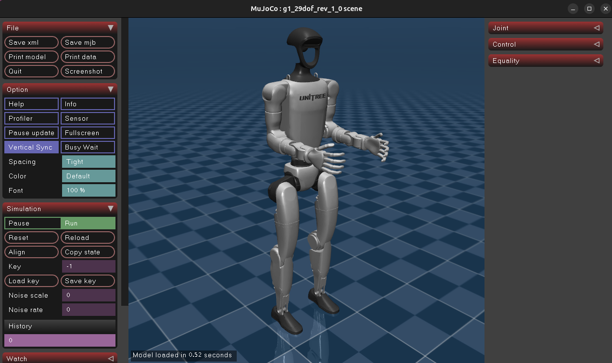

# MuJoCo Experience

Google DeepMind MuJoCo 物理引擎学习与实践项目。MuJoCo (Multi-Joint dynamics with Contact) 是一个高性能的物理仿真引擎，广泛用于机器人学、生物力学和机器学习研究。

<div align="center">
  
  <p><i>Unitree G1 人形机器人在 MuJoCo 中的仿真</i></p>
</div>

---

## 📓 交互式指南 (Notebooks)

所有运行指南均以 Jupyter Notebook 形式提供，可直接执行命令并查看输出：

| Notebook                          | 说明                                                    |
| --------------------------------- | ------------------------------------------------------- |
| [`DEMO.ipynb`](./DEMO.ipynb)       | C++ 仿真器 (`simulate`) 与内置/Menagerie XML 模型演示 |
| [`SCRIPTS.ipynb`](./SCRIPTS.ipynb) | Python 控制脚本：VLA、ACT、Diffusion 策略与基础控制     |
| [`UNITREE.ipynb`](./UNITREE.ipynb) | Unitree 机器人 (Go2/B2/H1/G1) sim-to-real 仿真流程      |
| [`PI05.ipynb`](./PI05.ipynb)       | Pi05 VLA 模型推理演示（`pi05_minimax_vla` 子模块）    |

> 在 VS Code / JupyterLab 中打开任一 notebook，按顺序执行 cell 即可。

---

## 项目结构

```
mujoco-experience/
├── mujoco/                    # MuJoCo 源码 (submodule)
│   ├── model/                 # 内置示例模型 (XML)
│   ├── sample/                # C++ 示例代码
│   ├── simulate/              # 图形化仿真器源码
│   ├── python/                # Python 绑定 (含 tutorial/LQR/rollout 等 ipynb)
│   └── mjx/                   # MJX (JAX 加速版，含 training_apg.ipynb)
├── mujoco_menagerie/          # 第三方机器人模型库 (submodule)
├── unitree_mujoco/            # Unitree 仿真器 C++ 版 (submodule)
├── unitree_sdk2_python/       # Unitree SDK2 Python 绑定 (submodule)
├── unitree_rl_gym/            # Unitree 强化学习训练环境 (submodule)
├── DeepMimic_mujoco/          # DeepMimic 动作模仿 (submodule)
├── rsl_rl/                    # RSL 强化学习库 (submodule)
├── pi05_minimax_vla/          # Pi05 VLA 模型 (submodule)
├── scripts/                   # Python 演示与控制脚本
├── doc/                       # 文档资产 (图片等)
├── patch_files/               # 子模块补丁
├── DEMO.ipynb                 # ▶ C++ 仿真器指南
├── SCRIPTS.ipynb              # ▶ Python 脚本指南
├── UNITREE.ipynb              # ▶ Unitree 仿真指南
├── PI05.ipynb                 # ▶ Pi05 VLA 指南
├── build.sh                   # 一键构建脚本
├── init.sh                    # 环境初始化脚本 (conda + pip)
├── init-unitree.sh            # Unitree 仿真器安装脚本
└── AGENTS.md                  # AI 代理协作说明
```

---

## 系统要求

| 类别   | 要求                                                |
| ------ | --------------------------------------------------- |
| CPU    | x86-64 或 ARM64                                     |
| GPU    | OpenGL 3.2+（图形渲染），CUDA（可选，MJX/VLA 推理） |
| OS     | Linux (Ubuntu 20.04+) · macOS · Windows           |
| 构建   | CMake 3.16+ · GCC/Clang/MSVC · Ninja (推荐)       |
| Python | 3.8+ （由 `init.sh` 创建 conda 环境 `mujoco`）  |

---

## 安装与构建

```bash
# 1. 克隆（含子模块）
git clone --recursive <your-repo-url> mujoco-experience
cd mujoco-experience

# 2. 初始化 conda 环境 + Python 依赖
./init.sh
conda activate mujoco

# 3. 构建 C++ 仿真器 → build/bin/simulate
./build.sh

# 4. (可选) 安装 Unitree 仿真器
./init-unitree.sh
```

> 如果克隆时遗漏 `--recursive`：`git submodule update --init --recursive`

---

## 快速体验

**① 可视化预览任意 MJCF 模型**

```bash
./build/bin/simulate ./mujoco/model/humanoid/humanoid.xml
./build/bin/simulate ./mujoco_menagerie/unitree_go1/scene.xml
```

👉 完整模型列表与操作键位见 [`DEMO.ipynb`](./DEMO.ipynb)

**② Unitree 机器人 sim-to-real**

```bash
./unitree_mujoco/simulate/build/unitree_mujoco -r go2 -s scene_terrain.xml
# 另开终端
./unitree_mujoco/example/cpp/build/stand_go2
```

👉 控制策略、ROS2 集成见 [`UNITREE.ipynb`](./UNITREE.ipynb)

**③ Python / VLA 策略**

```bash
python scripts/vla_inference_demo.py
```

👉 全部脚本说明见 [`SCRIPTS.ipynb`](./SCRIPTS.ipynb)；Pi05 推理见 [`PI05.ipynb`](./PI05.ipynb)

**④ Go2 PPO 行走策略**

<div align="center">
  
  <p><i>HuggingFace 上的 <code>diasAiMaster/unitree-go2-velocity-flat</code> PPO 策略（ONNX, <1MB），45-D obs → 12-D 关节增量，50 Hz 推理 + 200 Hz PD 力矩驱动</i></p>
</div>

```bash
python scripts/quadruped_locomotion_demo.py --vx 0.6        # 前进
python scripts/quadruped_locomotion_demo.py --vx 0.5 --wz 0.5  # 边走边转
```

---

## 学习路径建议

1. **入门** → [`mujoco/python/tutorial.ipynb`](./mujoco/python/tutorial.ipynb)（官方 Python 教程）
2. **可视化把玩** → [`DEMO.ipynb`](./DEMO.ipynb) 跑各种 XML 模型
3. **控制理论** → [`mujoco/python/LQR.ipynb`](./mujoco/python/LQR.ipynb) · [`least_squares.ipynb`](./mujoco/python/least_squares.ipynb) · [`rollout.ipynb`](./mujoco/python/rollout.ipynb)
4. **建模 API** → [`mujoco/python/mjspec.ipynb`](./mujoco/python/mjspec.ipynb)
5. **GPU 加速训练** → [`mujoco/mjx/tutorial.ipynb`](./mujoco/mjx/tutorial.ipynb) · [`training_apg.ipynb`](./mujoco/mjx/training_apg.ipynb)
6. **Menagerie 模型库** → [`mujoco_menagerie/tutorial.ipynb`](./mujoco_menagerie/tutorial.ipynb)
7. **机器人实战** → [`UNITREE.ipynb`](./UNITREE.ipynb) → [`SCRIPTS.ipynb`](./SCRIPTS.ipynb)
8. **VLA 前沿** → [`PI05.ipynb`](./PI05.ipynb) + `scripts/quadruped_locomotion_demo.py`

---

## 官方资源

- 仓库：[google-deepmind/mujoco](https://github.com/google-deepmind/mujoco)
- 文档：[mujoco.readthedocs.io](https://mujoco.readthedocs.io/)
- 模型库：[mujoco_menagerie](https://github.com/google-deepmind/mujoco_menagerie)
- MJX (JAX)：[mujoco/mjx](https://github.com/google-deepmind/mujoco/tree/main/mjx)
- Unitree SDK2：[unitreerobotics/unitree_sdk2](https://github.com/unitreerobotics/unitree_sdk2)

---

## 许可证

MuJoCo 使用 Apache License 2.0。各子模块遵循其自身许可证。
